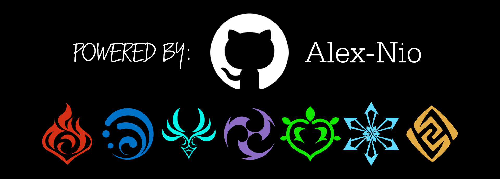

# GAN

## Genshin Artifact Notes

---

**GAN-Genshin Artifact Notes** _is a simple web application that helps users keep track of their Genshin Impact artifact builds. Users can select their artifact set, the type of artifact, and the desired substats. The app then generates a note with all the necessary information._

---

### Features

- Artifact set selection
- Artifact type selection
- Top substat selection
- Additional substat selection
- Note creation
- Custom popups

---

### Technologies Used

Vue.js
Vuex
HTML/CSS
JavaScript

---

### Installation

To install GAN-Genshin Artifact Notes, simply clone this repository and open index.html in your preferred browser. No additional dependencies are required.

---

### Usage

1. Select your desired artifact set from the dropdown menu.
2. Choose the type of artifact you want to create a note for.
3. Select your desired top substat from the dropdown menu.
4. Select your desired additional substats by clicking on the icons.
5. Click on the "Create Note" button to generate a note with all the necessary information.

---

### Credits

This application was created by [Alex-Nio](https://github.com/Alex-Nio).

Thank you for using my fan-made application! I created this app to help players of Genshin Impact keep track of their collected artifacts more easily. I hope that my app will provide a convenient and useful tool for the Genshin Impact community.

Please note that this app is not affiliated with or endorsed by **miHoYo**, the official developer of **Genshin Impact**. For official news and updates, please visit their website at https://www.mihoyo.com/en/.

---

### License

This project is licensed under the GNU license. See the LICENSE file for details.
